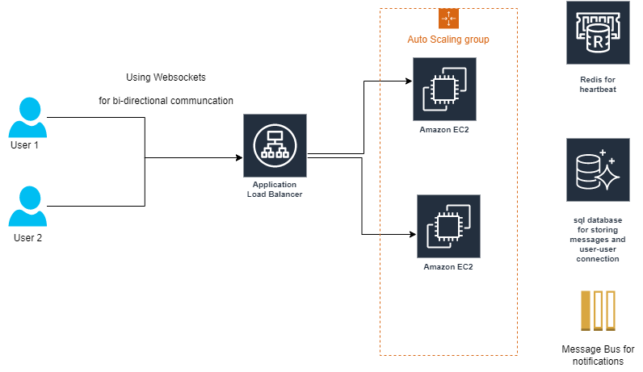
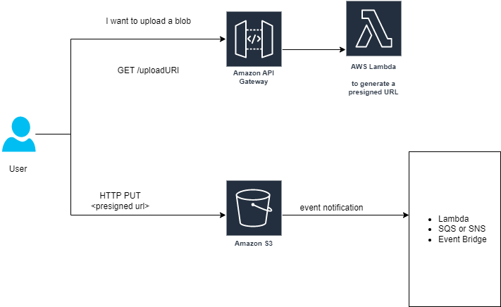
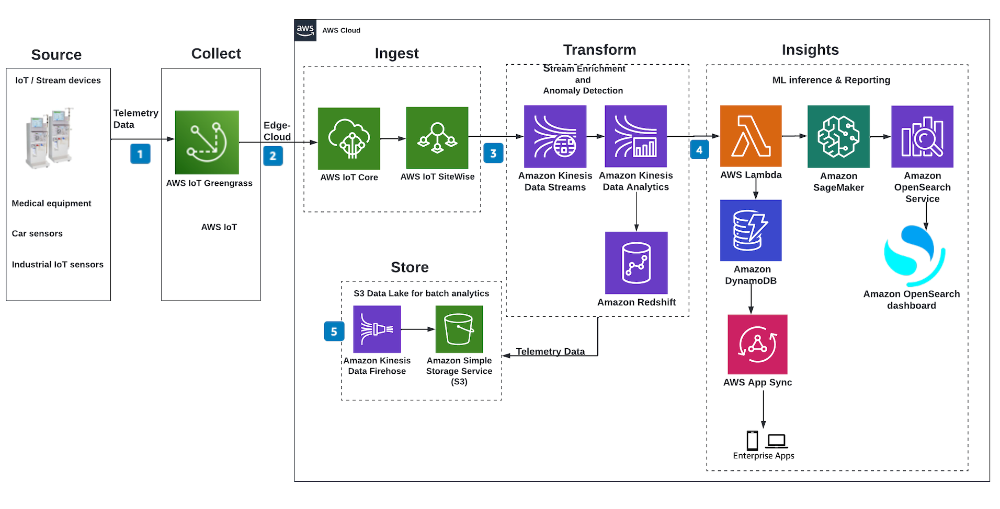
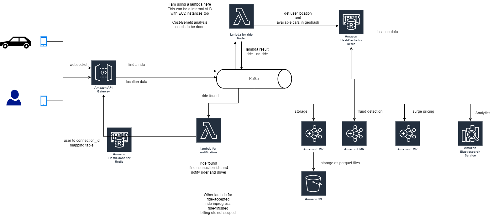
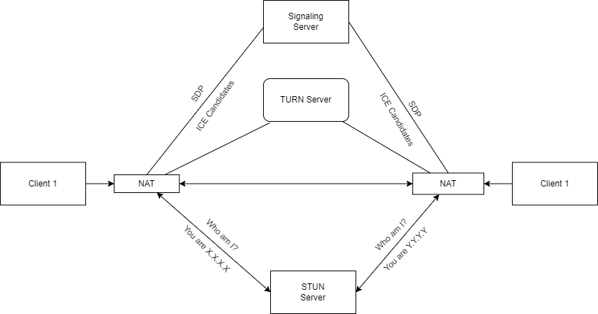

# Communicating with a remote server over AWS network

### Problem Statement

Say you have a some machines that need to communicate over the AWS network, eg.  
*  a chat application, (limiting ourselves to 1-1 chat)
*  a sensor fitted data-collecting car going back to the hub and uploading its data to the cloud (think Google Street View cars)
*  a location monitoring setup for a car (think uber ride finding service)
*  a car communicating with a remote operator (think remote driving/assistance via Video Call)

Each of these scenarios require a different approach and I want to collect my thoughts how I would implement these.  
I am a strong advocate for Cloud Computing and Serverless Architectures, so I wont be spinning up an EKS cluster to be a silver-bullet.
Instead I will explore each problem and possible solutions

### A Chat Application

Thinking of [whatsapp system design](https://github.com/rgyani/system-design-examples/blob/main/whatsapp.md), we could use a Application Load Balancer approach to spin up servers allowing users to connect and retrieve message, and use a Redis in-memory database as detailed in the diagram below

Say User_1 logs into the app, a websocket connection is established with the Application Load Balancer, which routes the request to an EC2 instance (with an ID say Instance_1). 

ALB supports a feature called sticky sessions, which means all requests coming from the same client are always sent to the same server. This is a critical feature for our user-case, as described below 

>##### WebSockets
>
>In traditional HTTP, the client sends a request to the server, and the server responds with the requested data. This request-response model requires continuous polling from the client to the server, which can result in increased latency and decreased efficiency.
>
>On the other hand, WebSockets establish a persistent connection between the client and the server. This means that once the connection is established, **the client and the server can send data to each other at any time without continuous polling**. This allows realtime communication, where updates can be sent and received instantly.

Now the request is with the EC2 instance, it logs the information User1-Instance_1 into a redis, in-memory database, and scans the MySQL database for
1. Friends of the User_1 and then in the in-memory database for all friends which are online (ie. have a User<ID>-instance<ID> mapping present)
2. Offline messages from the MySQL database   

This data is passed back to the user_1 using Websocket, but the work of EC2 instance is not done yet.

It needs to notify each of the other instances that user_1 is online now. Instead of using a RPC communication to each of the instance, I would prefer to post this message into a MessageBus. I would prefer to use Kafka here, which has One topic for each of the Instances. eg, 
* Instance_1 is subscribed to a topic called Messages_for_Instance_1, 
* Instance_2 is subscribed to a topic called Messages_for_Instance_2 and so on

Say User_2 was already logged into the app, and is connected to a different EC2 instance (say Instance_2) which is listening to Messages_for_Instance_2 topic

Now User_1 is a friend of User_2, so when User_1 came online, the Instance_2 receives a message in the Messages_for_Instance_2 topic and then can notify the User_2, via websockets, that User_1 is online now

Since we are storing the User_Instance mapping in a in-memory database, we need to periodically send a heart-beat to maintain this mapping.

Now User_1 wants to chat with User_2, again a message is sent over websockets to instance_1, which stores the messages in a SQL DB and further finds the instance connected to User_2 from the in-memory DB and post a message in Messages_for_Instance_2.   
Instance_2 receives this notification and again uses Websocket to transmit this message to User_2

##### Authentication and Authorization
Since this is a chat application, we would ideally allow signup using Whatsapp like SMS authentication. Implementing that is pretty simple, user provides a phone number, we send a SMS containing a unique code (using Amazon Pinpoint) and use the code returned via API Gateway to complete signup of the user. The user's addressbook can then be sent over API Gateway (periodically) to find connections 

#### Security
Since we have a public facing ALB, we need to use AWS WAF to protect against common web exploits (layer 7).   
AWS WAF has a library of over 190 Ready-to-use rules that are managed by AWS and AWS Marketplace Sellers to protect against common threats.  
Further we can define Web ACL (Web Access Control List):
* Rules can include IP addresses, HTTP headers, HTTP body, or URI strings
* Protects from common attack - SQL injection and Cross-Site Scripting (XSS)
* Size constraints, Geo match
* Rate-based rules (to count occurrences of events)
* Rule Actions: Count | Allow | Block | CAPTCHA

### File uploading from one client and notification

We could have scenarios where a user/machine wants to upload a large blob to the cloud and the user/machine on the other end needs to be notified. The scenarios could be a cloud-upload after a self-driving simulation like Google Street View or even a Chat user in the above use-case sending a large file

I would **NOT** recommend using Websockets for this use-case.

I would prefer to use an API gateway + Lambda combination to dynamically generate a short-lived presigned URL to enhance the security of the solution.  
The advantage is we don't need to make the bucket public, each request will generate **a unique time-bound** URL which the user can use

S3 supports Event-Notifications, so that once the file upload is complete, it can generate a notification which can be used by Event-bridge or a lambda to, say update a database. 

If the use case is required public consumption, we could pre-configure the bucket for CDN distribution and the file automatically becomes available with a simple URL switch
>https://s3.amazonaws.com/[bucket-name]/folder/image.png  
>https://[distribution].cloudfront.net/[bucket-name]/folder/image.png

> SideNote: There are a lot of use-cases which use the S3 Event notification generated above for transcoding the uploaded video for multiple resolutions, device screen size etc.

##### Authentication and Authorization
Since we are using AWS API Gateway, we can integrate Cognito Authentication + Authorization

AWS WAF also integrates with API Gateway with rules running at regional or edge level 

### Continuous communication from one client to the cloud

Consider the scenario when a car need to continuously update its sensor data to the cloud.

### AWS Greengrass and IoTCore
* IoT Core is a pub/sub messaging broker with added features for device management, security, OTA etc.
* Greengrass is a software runtime designed to operate on edge devices and provides functionality to make it easier to develop edge solutions such as local compute, ML inference, ability to build custom components etc. 
* When you use Greengrass, it uses IoT Core for secure connectivity to AWS and other infrastructure services.

There is a whole FAQ dealing with questions and capabilities [here](https://aws.amazon.com/greengrass/faqs/)  
AWS has also published a reference architecture detailing the components used to [build event-driven architecture with iot sensor data](https://aws.amazon.com/blogs/architecture/building-event-driven-architectures-with-iot-sensor-data/)

[Source: from AWS reference architecture link above]

While the advantages obviously include things like Edge Computing, Security, Scalability, it can be complex to setup and configure for novice users and is only limited to devices compatible with AWS environment.

Lets consider the scenario where this setup might be an overkill and needs to be integrated with, say mobile devices (eg Uber ride finder service)

In this case Kafka is the industry standard for high-throughput, fault-tolerant and scalable data streaming. While AWS pushes Kinesis in its architecture diagrams, it also provides a AWS Managed Kafka solution to avoid the need for tuning and maintaining kafka cluster.  
My previous experience with Kafka leads me to believe it has higher throughput (30K to 1K for comparison).

### Why not MQTT?
MQTT is considered a competitor to Kafka, since the use-cases for these two technologies tend to overlap a bit.  
What helps me differentiate between the two is storage and throughput aspect.
* MQTT  offers lower latency, while Kafka can process messages at much higher throughput.
* MQTT DOES NOT offer any built-in functions for long-term data storage, whereas kafka provides robust distributed data-storage capabilities and hence the ability to reprocess the message in case of error.

So to sum-up MQTT is a viable solution when you have say in car, multiple sensors communicating with each other in real-time, but when it comes to cloud, the MQTT broker would be forwarding data to a kafka cluster using a MQTT-Kafka bridge

## What if I have a legacy application which can only send/receive data to a port
Suppose we have a legacy client-server application which can only communicate over some pre-configured ports and you want to deploy the client and server in separate locations and they need to communicate over the AWS network.

In this case, I would propose the following solution. But, this is hypothetical, I have not yet done a POC on this.

Hypothetically, we could spin up a public EC2 instance and redirect ports in such a way that
Client Application -> <Instance IP>:<Port 1> -- redirect -- <Instance IP>:<Port 2> --> Server Application

We could setup the public EC2 linux instance to redirect the ports using any of the following mechanism

1. Using iptables
> $ sudo iptables -t nat -A PREROUTING -p tcp --dport 80 -j REDIRECT --to-port 8080

2. Using socat
> $ sudo socat TCP-LISTEN:80,fork TCP:localhost:8080

3. Using firewalld
> $ sudo firewall-cmd --zone=public --add-forward-port=port=80:proto=tcp:toport=8080:toaddr=127.0.0.1

4. Using nftables
> $ cat forward.nft  
table ip nat {  
    chain PREROUTING {  
        type nat hook prerouting priority 0;  
        tcp dport 80 dnat to 127.0.0.1:8080  
    }  
}  

4. Using UncomplicatedFirewall
> $ sudo ufw route allow from any port 80 to 127.0.0.1 port 8080

While it’s not advisable to use multiple port redirection methods simultaneously as this can cause conflicts and unexpected behavior, we could theoretically open multiple ports on a single instance

### Why not use a Network Load Balancer
If the requirement was that the client application only wants to send data one way, Network Load Balancer would be an ideal fit, but remember, the original requirement states that the server can initiate a connection to the client too, hence am proposing this solution

ALB obviously, while providing sticky sessions is a no go, because of above reason and also, it can only redirect traffic to ONE-port on each EC2 instances

### Security
Remember WAF cannot be used for EC2 instances, so securing the server and open ports via a WAF is not possible.

However, we can use AWS System Manager Session Manager port-forwarding features to remove the requirement of Public IP Addresses and enable only authorized users to access the server by the following mechanism

### SSM Port-forwarding
AWS Systems Manager Session Manager allows you to securely connect to your EC2 instances, without the need to run and to operate your own bastion hosts and without the need to run SSH on your EC2 instances. When Systems Manager's Agent is installed on your instances and **when you have IAM permissions to call Systems Manager API**

So for this to work, you need to 
1. Create an IAM role with AWS Service "ec2" and  AmazonSSMManagedInstanceCore in permission policy
2. *Associate the role with the ec2 instance*. You don't need to allocate public IP address or even configure inbound or outbound rules for the security group associated with the instance
3. install the AWS cli Client as well as AWS session manager plugin

Then it is simple matter of authenticating your aws cli via .credentials or SSO and running the command
> $ aws ssm start-session --target instance-id $instance_id --document-name AWS-StartPortForwardingSession --parameters "localPortNumber=8080,portNumber=80"

or for ssh

> $ aws ssm start-session --target $instance_id

Once this session is established any request on your local port (provided above) is forwarded to the remote machine by SSM

# Video Chat/ Remote Assistance Use Case

Traditionally video chat is implemented using using a Peer-to-Peer connection over lossy-UDP using WebRTC protocol.   
Obviously, in a MS Teams call with multiple participants, this P2P connection will be replaced by a STAR topology with a central hub managing all the to-and-from communication 

A WebRTC session consists of
#### 1. Signaling: 
 Here all the clients tell a central signaling server the Ip/Ports available, the media types, and codecs

Session Description Protocol (SDP) is used to negotiate the session properties between two client endpoints.  
This requires a Signaling Server, which can be from a PaaS provider, or we can use a messaging service like GCM.

#### 2. Connecting
The clients now need to agree on a means of network connectivity (protocol/routing) for P2P communication. 
Each of the Peers proposes **Interactivity Connectivity Establishment (ICE)** candidates until they agree on one.

Discovery of possible ICE candidates is done with help of ICE servers: STUN and TURN

* STUN (Session Travel Utilities for NAT) servers simply help clients behind the NAT gateway, find their public IP and port
* TURN (Traversal using Relay NAT) servers is a relay/proxy that allows peers to exchange (UDP or TCP) media traffic when one or both parties are behind NAT

#### 3. Communication
Now we have identified the server and port to send the data to, we can use 
* Media Streams for Video and Audio
* Data streams for chat messages

### Using AWS Kinesis Video Streams
Amazon Kinesis Video Streams provides a standards-compliant WebRTC implementation as a fully managed capability. You can use Amazon Kinesis Video Streams with WebRTC to securely live stream media or perform two-way audio or video interaction between any camera IoT device and WebRTC-compliant mobile or web players. As a fully managed capability, you don't have to build, operate, or scale any WebRTC-related cloud infrastructure, such as signaling or media relay servers to securely stream media across applications and devices.

In a video chat app, the Master and Viewer use either the Javascript, iOS, or Android WebRTC SDK from AWS to communicate securely over a Websocket connection with the Kinesis Video Streams for WebRTC service

### Using MeetEcho Janus server on EC2 instances
[Janus](https://github.com/meetecho/janus-gateway) is an open source, general purpose, WebRTC server designed and developed by Meetecho. 

### Using AWS Chime as a WebRTC service
AWS Chime also provides as SDK for running a WebRTC server which you can host over auto-scaling EC2 instances behind a ALB

### AWS API Gateway (REST vs HTTP)

1. **REST API (10,000 RPS Limit)**  
The REST API type in API Gateway is the older, feature-rich option that includes many built-in capabilities:

#### Why REST APIs Have a Lower RPS?
- More Overhead
    - REST APIs support authentication (IAM, Cognito, Lambda Authorizers), request validation, transformations, logging, and integrations with various AWS services.
    - Each request undergoes multiple processing steps, increasing latency and reducing scalability.
- Built-in Features
    - API Keys & Usage Plans → Rate limiting per client.
    - Stage Variables → Configuration management for different environments.
    - Integration with AWS X-Ray → Adds tracing overhead.
- More Expensive and Heavier Processing
    -   REST APIs use a regional endpoint model, meaning they must handle the entire request lifecycle, including transformations and security checks.

#### Best Use Cases for REST APIs
- Applications requiring fine-grained request processing.
- APIs needing authentication, transformation, logging, and monitoring.
- Serverless applications using AWS Lambda.
- Multi-tenancy support with API Keys & usage plans.

2. **HTTP API (100,000 RPS Limit)**  
AWS introduced HTTP APIs as a lightweight, high-performance alternative to REST APIs.

#### Why HTTP APIs Have a Higher RPS?
- Lower Overhead
    - HTTP APIs strip down many of the advanced REST API features (e.g., request validation, stage variables, API Keys) for better performance.
    - They provide only essential features like JWT-based authentication (Cognito) and direct AWS service integrations.
- Simplified Routing & Execution
    - HTTP APIs are optimized for direct integrations with Lambda, ALB, and other HTTP backends.
    - API Gateway doesn’t need to process as many steps per request.
- Better Pricing & Scaling
    - HTTP APIs are cheaper than REST APIs.
    - They can handle 10x more RPS (100K vs. 10K) due to reduced processing.

#### Best Use Cases for HTTP APIs
- High-performance public APIs.
- Applications that don’t require extensive request transformation or validation.
- Simple microservices and event-driven architectures using Lambda.
- ALB or direct HTTP backend integration.

#### REST API vs. HTTP API Comparison
| Feature | REST API | HTTP API |
|---|---|---|
| RPS Limit| 10,000| 100,000 |
| Latency | Higher | Lower |
| Authentication | IAM, Cognito, Lambda Authorizers	| JWT (Cognito) |
| Request Transformation | ✅ Supported | ❌ Not Supported |
| Rate Limiting |	✅ Usage plans |	❌ No built-in per-user limits |
| Direct ALB Integration |❌ No |	✅ Yes |
| X-Ray Tracing |	✅ Yes |	❌ No |
| Cost |	Higher |	Lower |

